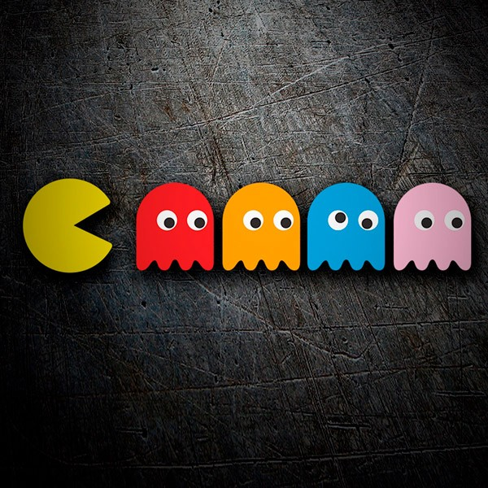
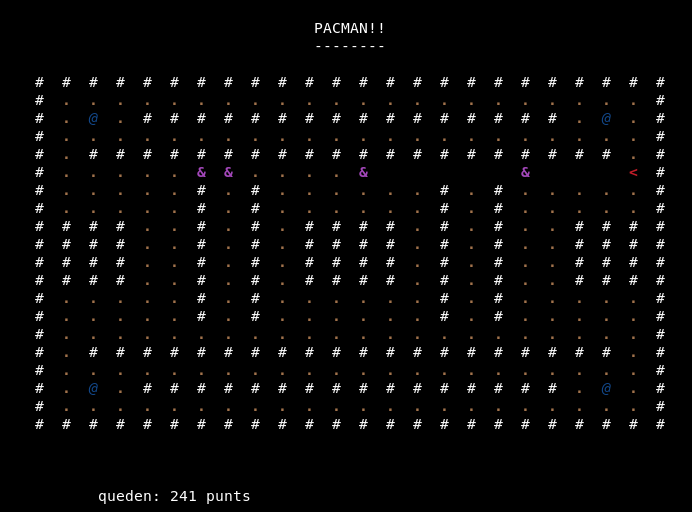

# Simple Pacman Estructurat

## Per practicar matrius

 - És el típic joc de pacman però fet amb matrius i caràcters.
- Hi haurà una matriu de números sencers que serà el taulell de joc

- Els objectes del joc es poden codificaran així, però podeu utilitzar la codificació que vullgau:
  
          ▪ paret		→ núm -1	→ #
          ▪ espai blanc	→ núm 0		→  
          ▪ ou petit	        → núm 1		→ · 
          ▪ ou gran	        → núm 2		→ @
          ▪ pacman 	        → núm 3		→ < -   >-   ^-   v-  
          ▪ fantasma	        → núm 8		→ &
  

El taulell (matriu) serà una matrius de números sencers i ha de quedar així:

### **Funcionament**:
-  El pacman es mou pel taulell menjant-se ous petits
-  Podem moure el pacman a partir de les tecles 2 (baix), 4(esquerra), 8(dalt), 6(dreta)
-  Al cap d'uns segons apareixen els 4 fantasmes
-  Els fantasmes van aleatòriament pel taulell sense travessar parets
-  Quan el pacman menja un ou gran hi ha un temps on els fantasmes no poden fer mal al pacman
-  El joc acaba quan el pacman es menja tots els ous o quan un fantasma toca al pacman